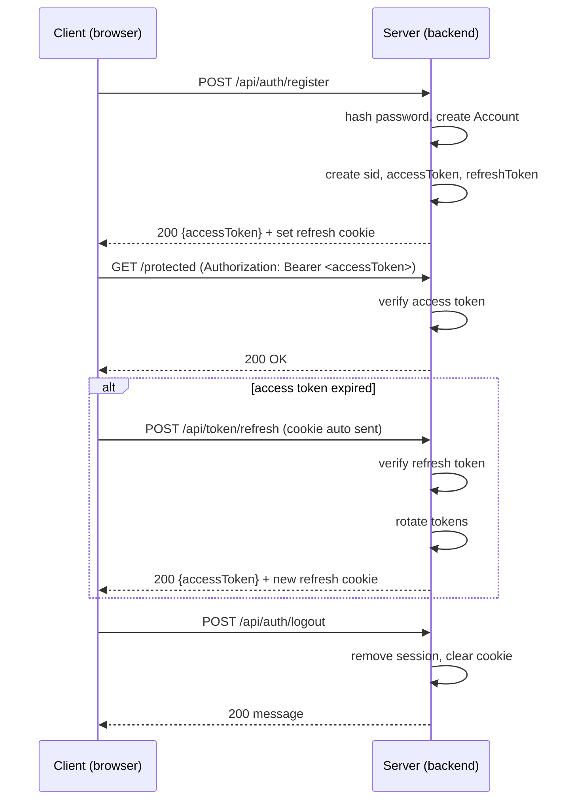

# Secure Access & Refresh Token Authentication (MERN + TypeScript)

A full-stack authentication example demonstrating a secure
access-/refresh-token architecture with token rotation, httpOnly
cookies, session tracking, and automatic renewal.\
This repository includes a TypeScript/Express + MongoDB backend and a
React/Vite frontend wired together---intended as a strong starter for
MERN apps that need robust JWT-based auth.

---

## Table of Contents

1. [Project Overview](#-project-overview)
2. [Tech Stack](#-tech-stack)
3. [Features](#-features)
4. [Architecture / How It Works](#-architecture--how-it-works)
5. [Folder Structure](#-folder-structure)
6. [Environment Variables](#-environment-variables)
7. [API Documentation](#-api-documentation)
8. [Data Models (Backend)](#-data-models-backend)
9. [Frontend Usage](#-frontend-usage)
10. [Security Notes](#-security-notes)
11. [Setup & Run](#-setup--run)
12. [Troubleshooting](#-troubleshooting)

---

## Project Overview

This project implements a secure authentication system using JSON Web
Tokens (JWTs):

- Short-lived access tokens included on API requests\
- Long-lived refresh tokens stored in an httpOnly cookie\
- Token rotation with refresh token hashing and session management\
- Login, registration, logout\
- Automatic token refresh on application load (splash/init flow)

The backend exposes auth + refresh endpoints, while the frontend
demonstrates protected routing, auth pages, and an Axios client that
injects tokens and refreshes automatically.

---

## Tech Stack

### Backend

- Node.js / Express
- TypeScript
- MongoDB + Mongoose
- JWT (jsonwebtoken)
- bcryptjs for password + refresh-token hashing
- geoip-lite & ua-parser-js for session metadata
- cors, helmet, rate limiting, cookie parser, dotenv

### Frontend

- React + React Router
- Vite + TypeScript
- Zustand (state/store)
- Axios (custom instance)
- Tailwind CSS

---

## Features

- Access token authentication via Authorization: Bearer
  `<token>`{=html} header\
- Refresh token flow using an httpOnly cookie\
- Token rotation on successful refresh\
- Refresh token hashing in the database (never stored plaintext)\
- Session tracking (sid, IP/geo, user-agent, expiresAt)\
- Expired session cleanup\
- Logout revokes only the current session\
- Auto refresh on app load with refresh promise locking

---

## Architecture / How It Works

### Authentication lifecycle



---

## Folder Structure

```text
backend/
  src/
    controllers/
    db/
    middlewares/
    models/
    routes/
    services/
    types/
    utils/
    index.ts

frontend/
  src/
    api/
    assets/
    axios/
    components/
    layouts/
    loaders/
    pages/
    routes/
    stores/
    types/
    utils/
    App.tsx
    index.css
    main.tsx
```

---

## Environment Variables

### Backend

---

Name Example Required Description

---

PORT 5000 - HTTP server port the backend runs on

NODE_ENV development - Application environment (development | production)

MONGO_DB_URI mongodb://127.0.0.1:27017/<project_name> - MongoDB connection string

CORS_ORIGINS http://localhost:5173 - Comma-separated list of allowed frontend origins

GLOBAL_RATE_LIMIT_MINUTES 15 - Rate limit time window in minutes

GLOBAL_RATE_LIMIT_MAX 100 - Maximum number of requests per window

JWT_ACCESS_TOKEN value - Secret key used to sign access tokens

JWT_REFRESH_TOKEN value - Secret key used to sign refresh tokens

REFRESH_COOKIE_NAME value - Name of the httpOnly refresh token cookie

REFRESH_COOKIE_PATH value - Cookie path scope (e.g., /token/refresh)

---

### Frontend

Name Example Required Description

---

VITE_API_URL http://localhost:5000 Yes Backend base URL

---

## API Documentation

Base URL: {VITE_API_URL}/api

### POST /auth/register

Request:

```json
{ "name": "Alice", "email": "alice@example.com", "password": "password" }
```

Response:

```json
{ "message": "Account registered successfully.", "accessToken": "<jwt>" }
```

### POST /auth/login

Request:

```json
{ "email": "alice@example.com", "password": "password" }
```

Response:

```json
{ "message": "Login successfully.", "accessToken": "<jwt>" }
```

### POST /auth/logout

Response:

```json
{ "message": "Logged out successfully." }
```

### POST /token/refresh

Response:

```json
{ "message": "Token refreshed.", "accessToken": "<new-jwt>" }
```

---

## Data Models (Backend)

### Account

```ts
{
  name: string,
  email: string,
  password: string,
  sessions: SessionType[]
}
```

### SessionType

```ts
{
  sid: string,
  token: string,
  expiresAt: Date
}
```

---

## Frontend Usage

- Access token stored in Zustand (memory only)
- Axios configured with withCredentials: true
- Request interceptor injects Authorization header
- Splash screen triggers refresh on app start
- Route guards redirect based on token state

---

## Security Notes

- httpOnly refresh cookie
- Secure flag in production
- Token rotation on refresh
- Refresh token hashing in DB
- Short-lived access token, longer refresh token
- Session-based refresh validation

---

## Setup & Run

### Backend

```bash
cd backend
cp .env.example .env
npm install
npm run dev
```

### Frontend

```bash
cd frontend
cp .env.example .env
npm install
npm run dev
```

---

## Troubleshooting

- Ensure CORS allows frontend origin
- Ensure axios uses withCredentials: true
- Confirm Authorization header matches backend middleware
- Verify MongoDB is running
